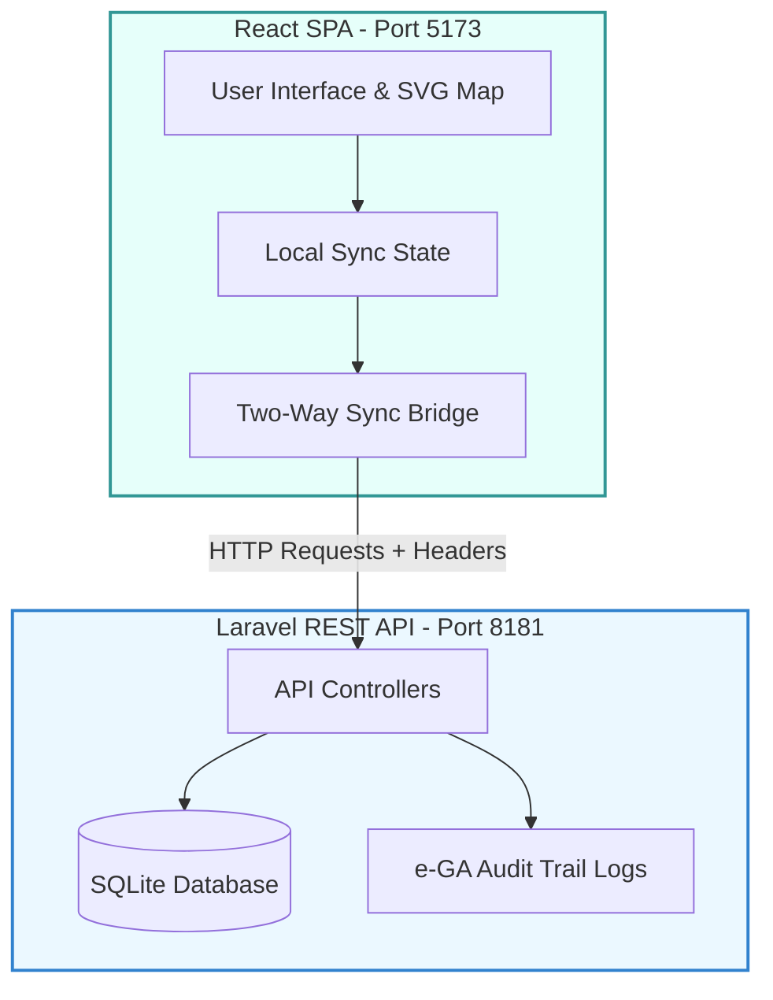

# MoEST Monitoring & Evaluation (M&E) Dashboard System

This repository contains the official Monitoring & Evaluation (M&E) Dashboard System built for the **Ministry of Education, Science and Technology (MoEST)**. The system is designed to provide high-level policy planners, national M&E coordinators, and district/school data entry officers with a unified, interactive portal for tracking sector performance indicators, managing strategic frameworks, and monitoring investment projects.

The architecture is fully compliant with the **MoEST System Design Document (SDD)**, featuring e-GA interoperability guidelines, secure user-ownership rules, and immutable audit logs under the Personal Data Protection Act (2022).

---

## 🏗️ System Architecture

The project is structured into a modern dual-track architecture:
1. **Frontend**: Single Page Application built on **React (Vite)** with native SVG choropleth mapping, attainment charts, and custom searchable selectors.
2. **Backend**: RESTful API service built on **Laravel 11** using **SQLite** for lightweight, self-contained relational database management.



---

## 🚀 Setup & Installation

Follow these steps to run the frontend and backend servers locally on your machine.

### Prerequisites
- **Node.js** (v18+ recommended) & **npm**
- **PHP** (v8.2+ recommended) & **Composer**
- SQLite command-line tool (optional, for DB inspections)

---

### 1. Backend (Laravel API)
The SQLite database has been pre-migrated and pre-seeded with baseline sector frameworks, regional targets, indicators, and initial activities.

1. Navigate to the backend folder:
   ```bash
   cd backend/laravel-app
   ```
2. Install dependencies:
   ```bash
   composer install
   ```
3. Copy the environment file (it comes pre-configured for SQLite):
   ```bash
   cp .env.example .env
   ```
4. Start the development server on port **8181**:
   ```bash
   php artisan serve --port=8181
   ```

The backend is now listening at `http://127.0.0.1:8181/api`. You can view all registered routes by running `php artisan route:list`.

#### 📖 Interactive API Documentation (Swagger UI)
Swagger UI is embedded in the application without extra server dependencies.
- **Interactive UI**: Open your browser and navigate to `http://127.0.0.1:8181/docs`.
- **OpenAPI Spec File**: Located in `backend/laravel-app/public/openapi.json`.

---

### 2. Frontend (React SPA)
The frontend uses a two-way synchronization bridge to preload database records into state on mount and sync mutations (creates, updates, deletes) back to the database in real-time.

1. Navigate to the frontend folder:
   ```bash
   cd ../../frontend
   ```
2. Install dependencies:
   ```bash
   npm install --legacy-peer-deps
   ```
3. Copy the environment configuration:
   ```bash
   cp .env.example .env
   ```
4. Start the development server:
   ```bash
   npm run dev
   ```

Open `http://localhost:5173/` in your browser. You can select different roles in the top-right navigation dropdown (e.g. System Administrator, School Data Entry Officer) to simulate various permissions.

---

## 🔒 Security & Authorization Constraints

The system implements strict context-aware data ownership gates and administrative restrictions.

### 1. Data Entry Ownership Rules
- Users can update or delete **only the actual data entries they originally submitted** (based on username matching).
- Attempts by unauthorized users to modify other users' entries are rejected by Laravel controller validation guards with a `403 Forbidden` response.
- **Workflow Reset**: If a data submission has already been marked as `Verified` or `Approved` by M&E officers, any value update on it resets its status to `Submitted`, forcing it to repeat the review process.
- **Soft Delete**: All deletions preserve audit tracking using soft-delete columns (`deleted_at`, `deleted_by`).

### 2. Administrative Settings Gating
- Creating, modifying, or deleting strategic frameworks, results chain nodes, projects, custom level types, or KPI definitions is restricted **exclusively** to:
  - `System Administrator`
  - `National M&E Officer`
- Non-permitted users see a yellow warning banner, have all administration forms and settings disabled, and cannot perform save or delete actions.

### 3. Parent-Child Deletion Constraints for Nodes
- To protect the results chain structure, **a parent node cannot be deleted if it has child nodes**.
- Users must delete all child nodes first before removing the parent.
- Parent nodes can still be updated or remapped at any time.

### 4. e-GA Immutable Audit Trails
- All creations, modifications, deletions, authentication events, and API syncs write detailed records to the `audit_logs` table (detailing timestamp, username, action, modified entity, and parameters).
- Audit logs are displayed in the **Audit Trail** tab in the Admin screen.

---

## 🗂️ Database Seeding & Testing Accounts

The database comes seeded with the following pre-configured testing profiles:

| Name | Username / Email | Role | Scope / Department |
| :--- | :--- | :--- | :--- |
| **Hamis Juma** | `admin@moe.go.tz` | System Administrator | ICT Unit |
| **Dr. Leonard Akwilapo** | `executive@moe.go.tz` | MoEST Leadership | Permanent Secretary Office |
| **Neema Temu** | `evaluator.national@moe.go.tz` | National M&E Officer | M&E Section |
| **Said Mwinyi** | `reo.dodoma@moe.go.tz` | Regional M&E Officer | Dodoma Regional Office |
| **Mary Chisunga** | `deo.dodoma@moe.go.tz` | District Education Officer | Bahi District Council |
| **Peter Temba** | `school.entry@moe.go.tz` | School Data Entry Officer | Bahi Primary School |
